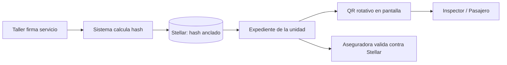
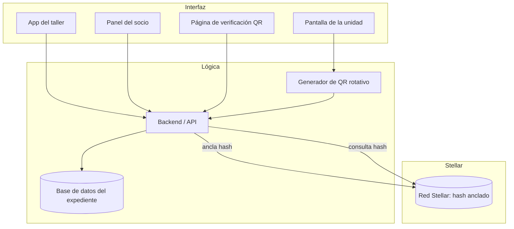

# Product Blueprint

**Nombre del proyecto:** QRuta

**Repositorio (enlace obligatorio):** [COMPLETAR: QRUTA](https://github.com/Oni7u7/QRuta)

---

## Contenido

1. Priorización de historias
2. Propuesta de valor
3. Flujo de usuario
4. Alcance del MVP
5. Lean Canvas
6. Backlog priorizado (Kanban)
7. Arquitectura inicial
8. Uso de Stellar y justificación

---
## 1. Priorización de historias
 
**Criterio de priorización:** Usamos MoSCoW (imprescindible / debería / podría) y lo cruzamos con dos preguntas: (1) ¿resuelve el problema central, que el socio pierda la cobertura de la aseguradora por no poder probar su mantenimiento? (2) ¿sin esta historia el flujo de punta a punta deja de funcionar? Las historias parecidas de distintos integrantes se fusionaron en una sola.
 
| Prioridad | Historia | Propuesta por | Por qué entra al backlog |
| :---: | --- | :---: | --- |
| 1 | Como socio dueño de una unidad quiero que cada servicio de mantenimiento quede registrado con fecha y huella digital inalterable en un expediente digital para demostrar ante la aseguradora que mi unidad tenía mantenimiento vigente y no perder la cobertura civil. *(Imprescindible)* | Diego (#1), Edgar (#6) | Es la razón de ser del producto: el socio se descapitaliza cuando no puede probar su mantenimiento. |
| 2 | Como taller mecánico autorizado quiero firmar digitalmente cada servicio y generar un comprobante verificable anclado al expediente para que mi trabajo sea evidencia que nadie pueda cuestionar. *(Imprescindible)* | Diego (#2), Edgar (#5) | Sin la firma del taller no hay dato honesto en el origen. |
| 3 | Como taller sin conocimientos de blockchain quiero registrar y firmar un servicio desde el celular con un flujo tan simple como un formulario, sin llaves privadas, frases semilla ni XLM, para adoptar el sistema sin aprender tecnología nueva. *(Imprescindible)* | Andrés (#2) | Sin adopción del taller no hay datos en el origen. |
| 4 | Como administrador de la ruta quiero dar de alta, suspender y revocar talleres y laboratorios autorizados en un registro verificable para que solo firmas vigentes cuenten como evidencia. *(Imprescindible)* | Andrés (#1) | La confianza del sistema depende de saber quién puede firmar. |
| 5 | Como aseguradora o ajustador quiero consultar el expediente de una unidad, ver quién y cuándo registró cada servicio y exportar un reporte con las pruebas de anclaje en Stellar (hash, transacción y fecha) para adjuntarlo a mi dictamen. *(Imprescindible)* | Diego (#4), Edgar (#3), Andrés (#6) | Es la contraparte de la historia 1: si la aseguradora no puede validar y usar la evidencia, el registro no sirve. |
| 6 | Como inspector de SEMOVI quiero escanear el QR de la unidad desde mi teléfono y ver en el momento si su mantenimiento está vigente para verificar cumplimiento sin pedir papeles. *(Imprescindible)* | Diego (#5), Edgar (#4) | Lleva el expediente a la verificación en campo. |
| 7 | Como chofer quiero que el QR de la pantalla cambie solo cada 10–15 segundos para que nadie pueda fotografiar un código viejo y usarlo en otra unidad. *(Imprescindible)* | Diego (#6) | Sin rotación, el mecanismo anti-falsificación se cae. |
| 8 | Como equipo que opera la plataforma quiero que el costo de anclar cada registro en Stellar lo absorba la plataforma mediante cuentas patrocinadas para que ningún actor pague comisiones de red. *(Imprescindible, habilitador técnico)* | Andrés (#7) | Hace posible la historia 3 y mantiene el modelo de negocio sostenible. |
| 9 | Como socio dueño quiero recibir un aviso por WhatsApp o SMS días antes de que venza un mantenimiento para programarlo a tiempo. *(Debería)* | Edgar (#1), Andrés (#3) | Previene el problema en lugar de solo documentarlo. |
| 10 | Como administrador de la ruta o encargado de flotilla quiero ver en un tablero el estado (vigente, por vencer, vencido) de todas las unidades para actuar antes de un siniestro o una revisión. *(Debería)* | Fernanda (#2), Edgar (#2), Andrés (#4) | Escala el valor de una unidad a toda la concesión. |
| 11 | Como pasajero quiero escanear el QR y ver si la unidad está verificada, con la fecha del último mantenimiento, para viajar con más confianza. *(Debería)* | Fernanda (#3), Diego (#7) | Reutiliza el mismo QR y genera presión de cumplimiento. |
 
**Quedan fuera por ahora (Podría):** registro de antidoping con laboratorio (Diego #3), check-list diario del chofer (Fernanda #1), órdenes de corrección con evidencia antes/después (Fernanda #4), expediente para operadores que rentan (Fernanda #5), auditoría del historial de modificaciones (Edgar #7) y traspaso del historial al vender la unidad (Andrés #5).

---

## 2. Propuesta de valor

**Usuario (del Problem Brief):** El socio dueño de una unidad de transporte concesionado (el caso de Mario en el Problem Brief), que puede perder la cobertura de su aseguradora y enfrentar problemas legales por no poder comprobar la regularidad de su unidad. *[Coincide]*

**Resultado que obtiene:** Un expediente digital de mantenimiento de cada unidad, firmado por el taller y con una huella inalterable anclada en Stellar. Después de un accidente, el socio presenta a la aseguradora una prueba que nadie pudo modificar y conserva su cobertura civil.

**Por qué elegiría esta solución:** Protege su patrimonio, porque hoy una disputa de cobertura puede costarle ingresos, la unidad o la concesión. También cumple con SEMOVI sin cargar papeles: el inspector escanea un QR que cambia cada 10–15 segundos y ve en el momento si el mantenimiento está vigente. Además recibe alertas antes de que venza un servicio, así que evita el problema en lugar de solo documentarlo.

**En qué se diferencia de cómo lo resuelve hoy:** Hoy depende de notas en papel, facturas y carpetas en la oficina de la ruta, que se pierden, se cuestionan o se pueden alterar después del siniestro, y la aseguradora tiene que confiar en la palabra del socio o del taller. En nuestra solución el taller firma desde el origen, el registro es verificable por cualquier tercero contra Stellar y la información sensible nunca se publica: solo se ancla su huella (hash).

---

## 3. Flujo de usuario

| Paso | Rol | Qué hace | Punto de interacción |
| :---: | :---: | --- | --- |
| 1 | Taller autorizado | Registra el servicio (unidad, fecha, tipo, evidencia) y lo firma con su llave. | App web + billetera Stellar |
| 2 | Sistema | Calcula la huella SHA-256 del registro y la ancla en una transacción de Stellar. | Backend + red Stellar |
| 3 | Socio dueño | Recibe el comprobante, ve el expediente de su unidad y la alerta de próximo vencimiento. | Panel del socio |
| 4 | Chofer / unidad | La pantalla de la unidad muestra un QR que se renueva cada 10–15 segundos. | Pantalla dentro de la unidad |
| 5 | Inspector SEMOVI | Escanea el QR y ve el estado de vigencia en el momento. | Celular + página de verificación |
| 6 | Pasajero | Escanea el mismo QR y ve si la unidad está verificada y la fecha del último servicio. | Celular + página de verificación |
| 7 | Socio dueño | Tras un accidente, exporta el expediente completo. | Panel del socio |
| 8 | Aseguradora | Consulta el expediente y valida cada huella contra Stellar. | Portal de consulta + explorador de Stellar |

---

## 4. Alcance del MVP

| Dentro del MVP (funcionalidad central) | Fuera del MVP (deseable, para después) |
| --- | --- |
| Registro de servicio de mantenimiento firmado por un taller autorizado | Registro de antidoping con laboratorio independiente |
| Anclaje de la huella (hash) de cada servicio en Stellar | Check-list diario del chofer con foto y firma |
| Expediente digital por unidad con historial de servicios | Órdenes de corrección con evidencia antes/después |
| QR rotativo (10–15 s) y página de verificación para inspector y pasajero | Expediente compartido para operadores que rentan la unidad |
| Consulta de solo lectura para aseguradora, con validación contra Stellar | Tablero de flotilla completo y auditoría de modificaciones |
| Alertas básicas de vencimiento al socio | App nativa y paso a red principal (mainnet) |

**Por qué el recorte sigue entregando valor:** El MVP cubre el ciclo completo que resuelve el problema original: un taller certifica, la huella queda anclada, el socio la conserva y la aseguradora o la autoridad la verifica. Eso ya permite que el socio pruebe su mantenimiento tras un accidente y que SEMOVI verifique en campo, que es donde hoy se pierde el dinero. Lo que dejamos fuera (antidoping, flotillas, correcciones) amplía el expediente, pero no es necesario para demostrar que el mecanismo funciona. El antidoping además implica datos sensibles que conviene tratar con más cuidado en una segunda etapa.

---

## 5. Lean Canvas

**Enlace al Lean Canvas (obligatorio):** [COMPLETAR: Lean Canvas del proyecto]https://claude.ai/artifact/MC5NCqzZnXoUcxSUhhM1mY
| **Problema** | 
El pasajero no tiene forma de saber si la unidad en la que viaja recibió mantenimiento; solo puede confiar en calcomanías o papeles fáciles de falsificar.
Los registros de mantenimiento de los talleres están en papel o en sistemas aislados: nadie fuera del taller puede auditarlos ni comprobar que no se alteraron.
Autoridades, operadores y aseguradoras no cuentan con un historial confiable de cada unidad para supervisar, demostrar cumplimiento o evaluar riesgo.

ALTERNATIVAS ACTUALES

Bitácoras en papel y hojas de cálculo del taller o del operador.
Constancias y engomados de revisión vehicular periódica.
Inspecciones manuales y esporádicas de la autoridad.
Sistemas internos de gestión de flotillas (no verificables por terceros).

| **Segmento de usuarios** |
QUIÉN PAGA (B2B → B2G) Concesionarios y operadores de rutas de microbús.Aseguradoras de transporte público.Autoridades de movilidad (a mediano plazo).
QUIÉN LO USA: Talleres verificados: registran y firman los servicios.Pasajeros, inspectores y aseguradoras: verifican gratis, sin cuenta.
PRIMEROS USUARIOS (EARLY ADOPTERS): Operadores medianos de una ruta que ya llevan bitácora y quieren diferenciarse o negociar su seguro. (Hipótesis)  Talleres que ya atienden flotillas de transporte.(Hipótesis) |

| **Propuesta de valor única** |
El mantenimiento de tu unidad, verificable por cualquiera en segundos.
Un QR que no se puede falsificar con una foto, respaldado por un expediente que ningún taller ni operador puede alterar después de firmado.
CONCEPTO EN UNA LÍNEA
El historial de mantenimiento del transporte público, verificable en tiempo real y con prueba en blockchain. |

| **Solución** |
Expediente digital firmado por un taller verificado (KYB): tipo de servicio, kilometraje y checklist de frenos, llantas, luces, dirección, suspensión y cinturones.
Anclaje en Stellar: la huella SHA-256 del expediente se publica en la blockchain; cualquier alteración posterior se detecta.
QR dinámico en la pantalla de la unidad que cambia cada 15 s: se escanea con cualquier celular, sin app, y una foto vieja del QR no sirve. |

| **Canales** |
Venta directa a uniones y agrupaciones de transportistas.Talleres que ya atienden flotillas como canal: cada taller trae a sus operadores.Pilotos con la autoridad de movilidad local.
Aseguradoras que lo recomienden u ofrezcan a sus asegurados.
El QR visible en la unidad: cada pasajero que escanea conoce la marca.
Ecosistema Stellar: hackathons, bootcamps y fondos para proyectos.
Hipótesis ningún canal está probado todavía. |

| **Métricas clave** |
Unidades registradas y % con mantenimiento vigente.
Talleres verificados activos y expedientes firmados por mes.
Verificaciones (escaneos de QR) por mes.
Pilotos que pasan a cliente de pago; retención mensual de operadores.
DESEMPEÑO TÉCNICO DEL MVP
Tiempo de verificación pública: 0.3 – 0.8 s Medido
Registro y anclaje en Stellar: 4 – 6 s Medido |

| **Ventaja diferencial** | 
La tecnología por sí sola se puede copiar; la ventaja tiene que venir de lo que se acumula con el uso.
Historial acumulado por unidad: cada servicio firmado agrega datos que un competidor nuevo no tiene. Hipótesis
Red de talleres verificados: cuantos más talleres firman, más completo y valioso es el historial para todos (efecto de red). Hipótesis
Alianza con la autoridad de movilidad que adopte el QR como requisito. Hipótesis |

| **Estructura de costos** |
Infraestructura: hosting (Vercel) y base de datos (Supabase); planes gratuitos en el MVP, de pago al crecer.
Comisión de Stellar por registro: 100 stroops = 0.00001 XLM por expediente anclado. Medido
Verificación KYB de talleres: revisión manual de documentos (personal).
Pantalla ESP32 por unidad (fase 2): hardware e instalación; costo por estimar.
Desarrollo, soporte y ventas/alianzas.
Paso a mainnet: auditoría de seguridad y fondos en XLM para la cuenta de anclaje. |

| **Fuentes de ingresos** | 
Suscripción mensual por unidad para operadores y concesionarios. Hipótesis
Cuota del taller verificado: alta con KYB más suscripción, o cobro por expediente firmado. Hipótesis
API de consulta para aseguradoras (por consulta o por plan). Hipótesis
Licencia para la autoridad de movilidad como plataforma de cumplimiento (B2G). Hipótesis
La verificación para pasajeros es siempre gratuita.

Precios: [definir con entrevistas a operadores, talleres y aseguradoras].|

---

## 6. Backlog priorizado (Kanban)

**Enlace al tablero (obligatorio):** [COMPLETAR: Tablero Kanban en GitHub Projects](https://github.com/users/usuario/projects/1)

El tablero tiene las columnas *Backlog*, *Por hacer*, *En progreso*, *En revisión* y *Hecho*, con una tarjeta por cada historia de la sección 1 y sus criterios de aceptación.

---

## 7. Arquitectura inicial

**Diagrama (imagen o enlace):**

| Capa | Componente | Qué hace |
| :---: | --- | --- |
| Interfaz | App web del taller, panel del socio, página de verificación, pantalla de la unidad | Captura servicios, muestra expedientes y estado, y despliega el QR. |
| Lógica | Backend/API, base de datos, generador de QR | Guarda los datos completos fuera de la cadena, calcula hashes, valida firmas y emite QR con vigencia de 10–15 s. |
| Stellar | Cuentas de talleres y transacciones con el hash | Guarda la huella inalterable y permite verificar fecha y firmante. |

**En qué punto entra la red:** Solo en dos momentos. Primero, cuando el taller firma un servicio y el backend publica el hash en Stellar. Segundo, cuando alguien verifica un expediente y el backend (o la aseguradora directamente) compara el hash guardado con el anclado. Los datos completos y sensibles se quedan fuera de la cadena y la interfaz nunca depende de Stellar para mostrar el QR, así la verificación en campo es rápida.

---

## 8. Uso de Stellar y justificación

**Criterio de pertinencia (del Problem Brief):** [COMPLETAR: pegar el criterio del Problem Brief]. Borrador de apoyo: la blockchain se justifica cuando varias partes que no confían entre sí (socio, taller, aseguradora, autoridad) necesitan un registro compartido que ninguna pueda modificar. Aquí se cumple, porque la disputa por cobertura enfrenta justo a esas partes.

| Componente de Stellar | Para qué lo usamos | Por qué ese y no otra alternativa |
| --- | --- | --- |
| Cuentas y llaves (keypairs) | Identidad y firma de cada taller autorizado. | La firma queda ligada a una llave pública verificable, sin depender de un tercero. |
| Transacciones con `manage_data` / memo hash | Anclar el hash SHA-256 de cada servicio con fecha de cierre de libro. | Es lo mínimo para dejar una huella inalterable y evita escribir datos sensibles en la cadena. |
| Horizon / RPC | Consultar y verificar transacciones desde el backend y el portal de aseguradora. | Permite validar sin operar un nodo propio. |
| Testnet (MVP) y explorador público | Pruebas del MVP y verificación abierta por terceros. | Costo cero para validar la idea y transparencia para la aseguradora. |

**Por qué Stellar:** Sus comisiones son muy bajas (fracciones de centavo), el cierre de transacciones toma segundos y el modelo de cuentas encaja con talleres que firman. No usamos contratos inteligentes (Soroban) en el MVP porque un hash anclado basta; los consideraríamos después para reglas como vencimientos automáticos.
